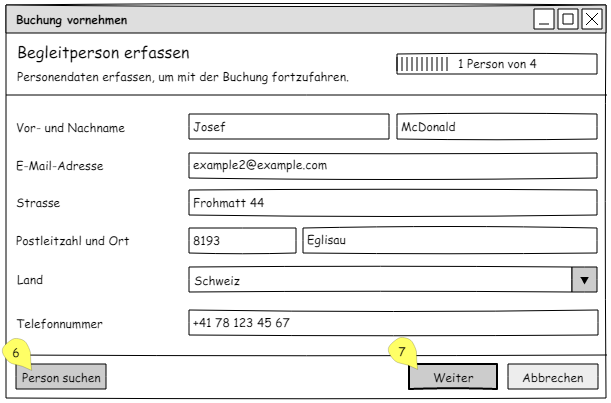

## Transactions and UI
### Block 4 "Audgabe 1 - GUI Buchungen"
Source: https://moodle.ffhs.ch/mod/forum/discuss.php?d=23894
> Skizzieren Sie ein GUI welches folgenden Anwendungsfall abdecken soll:
> - Eine Buchung soll getätigt werden. Dabei soll es sich um eine Buchung für ein einzelnes Doppelzimmer handeln.
> - Zuerst wird geprüft, ob ein Zimmer der gewünschten Kategorie frei ist.
> - Falls dies zutrifft, wird die Buchung ausgeführt und es wird angezeigt, welches Zimmer gebucht wurde.
> - Im Hotel tragen gleichzeitig mehrere Personen Buchungen ein. Diese können sich während des Vorgangs nicht absprechen.
> 
> Orientieren Sie sich dabei an den GUI-Elementen einer Web-Anwendung. Der Auftraggeber hat die folgenden Wünsche geäussert:
> - Einfacher Aufbau des GUIs
> - Keine unnötigen Elemente
> - Möglichst wenige Klicks
> - Schnelle Antwortzeiten
> 
> Halten Sie schriftlich fest, welche Aktionen (Klicks), welche SQL-Abfragen (select, insert, update, delete) auslösen sollen.
>
> Identifizieren Sie Transaktionen.

Um die Aufgabe zu lösen mussten folgende Annahmen getroffen werden:
 - Beim Überprüfen, ob ein freies Zimmer vorhanden ist, wird eine Zeitspanne angegeben.
 - Beim Durchführen der Buchung wird die Zeitspanne aus dem Überprüfen, ob ein freies Zimmer vorhanden ist.

Es geht um den einzelnen Anwendungsfall `Buchung vornehmen`.

Die Aktivität sieht wie folgt aus:

Dieser Ablauf lässt sich in mehrere Abschnitte unterteilen. Aus diesem Grund eignet sich ein sogenanter 
[Assistent (Wizard)](https://en.wikipedia.org/wiki/Wizard_(software)) welcher einem durch den Anwendungsfall führt.

Für diese Anzeige werden alle Raumtypen benötigt.

    START TRANSACTION;
    SELECT rt.name FROM room_type AS rt;
    COMMIT;

Beim Klick auf `Weiter` werden mit den eingegebenen Daten die verfügbaren Räume geholt und gelockt.

    START TRANSACTION;
    SELECT r.name, r.description FROM room AS r
      INNER JOIN room_type AS rt ON r.room_type_id = rt.id AND rt.name = 'Doppelzimmer'
      LEFT JOIN booking_room AS br ON r.id = br.room_id
      LEFT JOIN booking AS b ON br.booking_id = b.id
      WHERE (b.checkin <= '2018-02-14') AND (b.checkout >= '2017-02-12')
      FOR UPDATE;

Und nun noch die Daten abholen.

    SELECT r.name, r.description FROM room AS r
      INNER JOIN room_type AS rt ON r.room_type_id = rt.id AND rt.name = 'Doppelzimmer'
      LEFT JOIN booking_room AS br ON r.id = br.room_id
      LEFT JOIN booking AS b ON br.booking_id = b.id
      WHERE (b.checkin <= '2018-02-14') AND (b.checkout >= '2017-02-12');

Gibt es keine freien Zimmer zur Anfrage, so wird dieser Fehler angezeigt und die Suchdaten können angepasst werden.

Beim Klick auf `Weiter` wird der ausgewählte Raum gelockt.

    SELECT r.name, r.description FROM room AS r
      INNER JOIN room_type AS rt ON r.room_type_id = rt.id AND rt.name = 'Doppelzimmer'
      LEFT JOIN booking_room AS br ON r.id = br.room_id
      LEFT JOIN booking AS b ON br.booking_id = b.id
      WHERE (b.checkin <= '2018-02-14') AND (b.checkout >= '2017-02-12') AND (r.id = 23)
      FOR UPDATE;

Nun kann die Person erfasst werden. Beim Klick auf `Buchung speichern` werden die Daten eingefügt und die Buchung erstellt:

    INSERT IGNORE INTO `person` (`forename`, `surname`, `email`) VALUES
      ('Hans', 'Meier', 'example@examle.com');
    INSERT IGNORE INTO `phone_number` (`phone_number_type_id`, `number`) VALUES
      (2, '+41781234567');
    INSERT IGNORE INTO `person_phone` (`person_id`, `phone_number_id`) VALUES
      (1, 1),
    INSERT IGNORE INTO `place` (`name`, `zip`, `country_id`) VALUES
      ('Eglisau', '8193', 211);
    INSERT IGNORE INTO `address` (`street`, `place_id`) VALUES
      ('Frohmatt 22', 3),
    INSERT IGNORE INTO `person_address` (`address_id`, `person_id`) VALUES
      (1, 1),
    INSERT INTO `booking` (`checkin`, `checkout`, `responsible_person_id`) VALUES
      ('2017-03-15', '2017-03-30', 1);
    INSERT INTO `booking_room` (`booking_id`, `room_id`) VALUES
      (1, 1);
    COMMIT;

Dazwischen kommen natürlich noch jeweilige `SELECT`-Statements um die `ID` der erstellten Einträge zu holen. Es ist 
vielleicht auch sinnvoll `INSERT ... ON DUPLICATE KEY UPDATE` zu verwenden.

Für die Anzeige wird die Buchung wieder selektiert:

    SELECT ... FROM booking WHERE booking.id = 1;

### Block 4 "Aufgabe 2 - GUI Gruppenreisen"
Source: https://moodle.ffhs.ch/mod/forum/discuss.php?d=23895
> Skizzieren Sie ein GUI welches folgenden Anwendungsfall abdecken soll:
> 
> - Eine Buchung soll getätigt werden. Dabei soll es sich um eine Buchung für eine Buchung für eine Reisegruppe handeln. Es sollen entweder alle Mitglieder der Reisegruppe untergebracht werden können, oder keine. Bachten Sie dazu die Angaben aus den früheren Beschreibungen des Fallbeispiels.
> - Zuerst wird geprüft, ob genügend Zimmer der gewünschten Kategorieb frei sind.
> - Falls dies zutrifft, sollen die Buchungen ausgeführt werden und es wird angezeigt, welche Zimmer gebucht wurden.
> - Im Hotel tragen gleichzeitig mehrere Personen Buchungen ein. Diese können sich während des Vorgangs nicht absprechen.
> 
>Orientieren Sie sich dabei an den GUI-Elementen einer Web-Anwendung. Der Auftraggeber hat die folgenden Wünsche geäussert:
> 
> - Einfacher Aufbau des GUIs
> - Keine unnötigen Elemente
> - Möglichst wenige Klicks
> - Schnelle Antwortzeiten
> 
> Halten Sie schriftlich fest, welche Aktionen (Klicks), welche SQL-Abfragen (select, insert, update, delete) auslösen sollen.
> 
> Identifizieren Sie Transaktionen.

Dadurch, dass die Aufgabe 3 die eigentliche Implementation der Abfragen beinhaltet, wurden in dieser Aufgabe nur Prototypen 
von Abfragen definiert, da es hauptsächlich darum geht ein GUI zu skizzieren und Transaktionen zu identifizieren.

Diese Aufgabe ergänzt die Aufgabe 1 um die Funktionalität der Gruppenbuchung.

Mit den gelben Ettiketen werden jeweils gewisse Aktionen identifiziert.

1. Beim Klick auf weiter wird ein `SELECT` ausgeführt, welcher die verfügbaren Zimmer holt. Die Personenanzahl spielt für
die Abfrage keine Rolle. Es ist einfacher dies im Programm zu behandeln.

2. Bei einem Klick auf eine Checkbox wird eine Transaktion (`transaction1`) begonnen und die ausgewählten Zimmer zu dem 
 definierten Datum blockiert. Dies wird mit einem `SELECT .. FOR UPDATE;` gemacht. 
3. Beim Klick auf weiter passiert keine Abfrage. Es wird lediglich der nächste Schritt angezeigt.

4. Wird auf `Person suchen` geklickt, so wird mit den vorhandenen Eingaben in der Datenbank die Person gesucht und ggf. 
die Felder vervollständigt. Dies passiert mit einem `SELECT`.
5. Beim Klick auf `Weiter` werden die Personendaten in die Datenbank geschrieben. Dazu wird `UPDATE` verwendet, falls 
der Datensatz schon besteht oder `INSERT` wenn es sich um eine Person handelt welche noch nicht erfasst wurde. Dies 
passiert in einer separaten Transaktion.

6. Siehe Punkt 4.
7. Siehe Punkt 5.

8. Beim Klick auf `Buchung abschliessen` wird die Buchung mit `INSERT` erstellt und die Transaktion `transaction1` wird
ausgeführt.