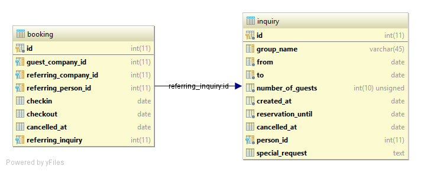
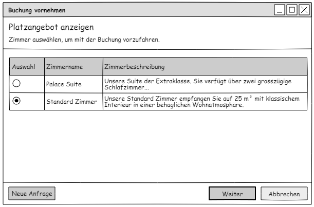

# DBS - Datenbanksysteme, Team Blue
This repository contains the project and task of the module DBS (Datenbanksysteme) at FFHS. 

## Documents and links
 - [Presentation from block one](https://docs.google.com/presentation/d/1M0BOXiqj37ZzCPe8XAA4hvNnRSBWwDz9cL3_vbIhnko/edit)
 - [Presentation from block two](https://docs.google.com/presentation/d/1Mrge2X00FnNLM3Qv8dNb31wuHrijHLbOAu7NWB1KdUI/edit)
 - [Presentation from block three](https://docs.google.com/presentation/d/1gXLZm-lSGiKdzJUAG8ASnWOtasNjlJuV6WsPfpHri4o/edit)

## Conventions
Everything in this repository should follow these conventions.

### Naming
 - English language is used for all names

Property | Rules | Example
--- | --- | ---
Attribute names | Singular, lower case, resolve special characters, join multiple expressions by underscore (a.k.a. snake_case). | ``street_number``  
Table names | Singular of entity type, lower case | ``person``, ``house``, ..
Join table names | Names of participating entity types, joined by an underscore | ``person_company``
Primary key | Use ``id`` | ``id``
Foreign key | Related table name with a ``_id`` postfix | ``person_id``
Constraint names | Use the this pattern ``{tablename}_{columnname(s)}_{suffix}``. The following suffixes should be used: <ul><li>``pk`` for primary keys</li><li>``fk`` for foreign keys</li><li>``idx`` for indexes</li><li>``uniq`` for unique keys</li><li>``check`` for check constraints</li><li>``seq`` for sequence numbers</li></li><ul> | ``person_person_type_id_fk`` |

## Test server
The test server provides an MySQL database, which can be used for the group tasks. This server is hosted at SWITCHengines 
and the MySQL server is available at ``86.119.36.10`` on port ``41337``.

Username | Password | Databases
--- | --- | ---
andre | ZlazuLJQg~j* | starview_andre
thomas | uvh*F?OVl^C4 | starview_thomas
samuel | 3T*frriskXm4 | starview_samuel
robin | ejNT3~K:8x*N | starview_robin

### Setup
 1. Create a new server instance at SWITCHengines <br> ``server create --flavor c1.medium --image "Ubuntu Xenial 16.04 (SWITCHengines)" --key-name robin dbs``
 1. Assign a public ip address <br> ``floating ip create public`` <br> ``server add floating ip dbs 86.119.36.10``
 1. Login into server <br> ``ssh -i .ssh/robin@engines.switch.ch ubuntu@86.119.36.10``
 1. Install updates <br> ``apt update && apt upgrade -y``
 1. Restart server <br> ``shutdown -r now``
 1. Install MySQL server <br> ``apt install mysql-server``
 1. Change port of MySQL server <br> ``nano /etc/mysql/mysql.conf.d/mysqld.cnf``
    1. Change ``port    3306`` to ``port    41337``
    1. Comment out ``bind_address``
 1. Restart MySQL server <br> ``service mysql restart``
 1. Create MySQL user databases and accounts <br> ``mysql -p`` and run
    ```
    CREATE USER andre@'%' IDENTIFIED BY 'ZlazuLJQg~j*';
    CREATE DATABASE starview_andre; 
    GRANT ALL ON starview_andre.* TO andre@'%';
    CREATE USER thomas@'%' IDENTIFIED BY 'uvh*F?OVl^C4';
    CREATE DATABASE starview_thomas; 
    GRANT ALL ON starview_thomas.* TO thomas@'%';
    CREATE USER samuel@'%' IDENTIFIED BY '3T*frriskXm4';
    CREATE DATABASE starview_samuel; 
    GRANT ALL ON starview_samuel.* TO samuel@'%';
    CREATE USER robin@'%' IDENTIFIED BY 'ejNT3~K:8x*N';
    CREATE DATABASE starview_robin; 
    GRANT ALL ON starview_robin.* TO robin@'%';
    FLUSH PRIVILEGES;
    ```
 1. Log out from server
 1. Create a new security group <br> ``security group create mysql``
 1. Open port ``41337`` in security group <br> ``security group rule create --dst-port 41337 mysql``
 1. Apply security group to server instance <br> ``server add security group dbs mysql``
 
## Model requirements

### Notizen des ersten Treffens
Source: https://moodle.ffhs.ch/mod/page/view.php?id=228280

ID | Status | Comment | Original text
--- | --- | --- | ---
0001 | ✔ | Solved by fields `forename`, `surname` and `email` in table `person`. | Die Zusammenarbeit mit den beliebten Online-Buchungsplattformen hat sich bewährt. Der Buchungsvorgang ist sehr einfach: Der Gast muss nur Vor- und Familienname sowie die E-Mail-Adresse angeben. Das Sternenblick lässt Stornierung ohne Kostenfolge zu.
0002 | ✔ | Travel Agencies and their employees can be stored as such using the `company_type` table. | Die unkomplizierte Zusammenarbeit mit vielen internationalen Reiseunternehmen bringt viele zusätzliche Gäste. Luzius ist überzeugt, dass dies vor allem an der intensiven Pflege des persönlichen Kontakts mit den Ansprechspersonen in den Reiseunternehmen liegt.
0003 | ✔ | There are no status fields telling if a present or email have been submitted to the guest. | Zum Geburtstag erhalten die Gäste jeweils eine Gratulation per E-Mail. Und Gäste, welche an Ihrem Geburtstag im Hotel sind, erhalten ein kleines Geschenk.

### Notizen des zweiten Treffens
Source: https://moodle.ffhs.ch/mod/page/view.php?id=228285

ID | Status | Comment | Original text
--- | --- | --- | ---
0101 | ✔ | Shouldn't an `employee` entity reference a `person_id` instead of a `person` reference an `employee_id` as it is currently the case? See: https://moodle.ffhs.ch/mod/page/view.php?id=228273 <br> **Yes, this is implemented like this now.**| Auch die Mitarbeiter des Hotels dürfen mit Familie und Verwandten das Hotel benutzen und erhalten dabei Sonderkonditionen.
0102 | ✔ | Solved by the `employing_company` field in the `booking` table that references the company of a guest at the time of the booking. | Zudem ist es in den vergangenen Jahren gelungen, immer wieder mit Firmen zusammenzuarbeiten, welche für ihre Mitarbeitenden Geschäftsreisen in die Gegend buchen. Die Geschäftsreisenden kommen dann gerne als Privatpersonen wieder und bringen ihre Familien mit.

### Notizen Telefonat nach dem zweiten Treffen
Source: https://moodle.ffhs.ch/mod/page/view.php?id=228286

"Aurelia zählt die folgenden Angaben auf, welche sie in den bisher vorhandenen Adressdateien und Tabellen auffinden konnte."

ID | Status | Comment | Original text
--- | --- | --- | ---
0201 | ✔ | Solved by the field `email` in table `person` | E-Mail-Adresse
0202 | ✔ | Solved by the field `birthday` in table `person` | Geburtsjahr
0203 | ✔ | Solved by the relation `person_phone` and the table `phone_number` | Telefonnummer, manchmal mehr als eine Nummer. Am wichtigsten ist die mobile Nummer, um den Gast auch unterwegs erreichen zu können.
0204 | ✔ | Solved by the field `street`, which is a text field, so it can contain any type of street name. | Eine Adresse kann mehrere Zeilen haben. Internationale Adressen können sehr umständlich formuliert sein.
0205 | ✔ | Solved by the field `zip` in table `address`. ZIP validation happens on application layer. | Postleitzahl - auch international (man habe viele Gäste aus Grossbritannien)
0206 | ✔ | Solved by the field `city` in table `address` | Ortschaft
0207 | ✔ | Solved by the field `country` in table `address` | Land
0208 | ✔ | Solved by the language and person_language table | Sprache
0209 | ✔ | Solved by the fields `social_insurance_number` (mandatory) and `legacy_social_insurance_number` (optional) | AHV-Nummer, aber nur bei Mitarbeitern. Bei einigen auch noch die alte AHV-Nummer
0200 | ✔ | Whatever this means ... | Von vielen Gästen gibt es keine genaue Adresse
0210 | ✔ | Solved by the FK relation `contact_person_id` in table `company` | Und bei Reisebüros braucht es noch die Ansprechperson.

### E-Mail von Aurelia
Source: https://moodle.ffhs.ch/mod/page/view.php?id=228287

ID | Status | Comment | Original text
--- | --- | --- | ---
0301 | ✔ | Solved by the `room_attribute` table | Wir haben Einzel- und Doppelzimmer. Dabei vermeiden wir es möglichst, Doppelzimmer durch Einzelpersonen zu belegen.
0302 | ✔ | Solved by the `room_attribute` table | Bei den Doppelzimmern haben wir Zimmer mit getrennten Betten und Zimmer mit Queen-Size-Betten.
0303 | ✔ | Solved by the `room_attribute` table | In der Hochzeit-Suite ist ein King-Size-Bett.
0304 | ✔ | Solved by the `room_attribute` table | Wir haben Zimmer mit Bad/WC und andere Zimmer mit Dusche/WC. Im "Blauen Salon" haben wir sogar einen Wirlpool und eine Dusche.
0305 | ✔ | Solved by the `room_attribute` table | Die meisten Zimmer haben eine Minibar.
0306 | ? | Probably solved by `room_attribute` where the building to which a booked room belongs could be stored. However, it would probably be more concise if we used a proper 'building' or 'hotel' entity type... | Wir bauen ja gerade die Dépendance. Bei Reisegruppen wollen wir darauf achten, dass alle entweder im Haupttrakt oder in der Dépendance untergebracht sind.
0307 | ✔ | Solved by the `room_attribute` table | Einige der Gäste achten bei der Buchung vor allem auf den Blick auf die Alpen.
0308 | ✔ | Solved by the `room_attribute` table | Für einige Gäste ist das Stockwerk sehr wichtig. Manche wollen möglichst weit unten wohnen und andere bevorzugen die oberen Stockwerke.
0309 | ✔ | irrelevant for db| Wir haben ausschliesslich Nichtraucher-Zimmer.

### Notizen zum dritten Treffen
Source: https://moodle.ffhs.ch/mod/page/view.php?id=228289

ID | Status | Comment | Original text
--- | --- | --- | ---
0401 | ✔ | Duplicate of #0101 | Mitarbeiter können auch Gäste sein und erhalten dann Sonderkonditionen für sich und ihre Begleitpersonen.
0402 | ✔ | Solved by the `referred_by` fields on `booking`. Travel Agencies (`company`) and Travel Agents can be SELECTed based on the amount of bookings they made in a given period of time.| Die Zusammenarbeit mit Reisebüros hat sich bewährt. Luzius möchte eine Übersicht erhalten, welches Reisebüro pro Jahr wieviele Übernachtungen bringt. Er trägt sich mit dem Gedanken, besonders guten Reisebüros Rabatt zu geben, oder auch besonders guten Mitarbeitern in Reisebüros zum Geburtstag eine kleine Aufmerksamkeit zu schicken. Aurelia fragt sich, woher sie das Geburtsdatum erfahren solle ...
0403 | ✔ | Solved by the `payment_card` table and optional fk `payment_card_id` from `booking_person` | Zur Buchung braucht man eigentlich nur die Angaben zur Person, sowie die E-Mail-Adresse. Aurelia meint, es wäre zeitgemässer, auch die Kreditkarte bei der Buchung zu verlangen. Auf den Online-Plattformen sei das üblich. Luzius meint, wir sollten das vorsehen (es solle aber vorerst nicht eine unbedingt notwendige Angabe sein).
0404 | ? | Could probably be solved by SELECTing all `room` entities that don't have any `booking` where `booking.checkin < now()` and `booking.checkout > now()`. However, maybe it's more efficient to add a 'occupied' property to the room entity type.| Bei der Buchung muss natürlich klar sein, ob das Hotel überhaupt Platz hat für die Übernachtung. Das Hotel hat 30 Zimmer mit verschiedenster Ausstattung. Aurelia hat ja dazu eine E-Mail geschickt.
0405 | ✔ | Room size can be stored in `room_attribute` | Luzius ist stolz auf die Einzelzimmer, welche ebenso geräumig sind, wie die Doppelzimmer.
0406 | ✔ | Solved by table `inquiry`| Aurelia weist darauf hin, dass Reisebüros oft anfragen, ob das Hotel Platz für eine Reisegruppe hätte. Dabei wird nur die Anzahl der Gäste genannt. Wenn Platz vorhanden ist, dann teilt das Reisebüro die Gäste selbst auf die Zimmer auf. Die Aufteilung wird dann beim Check-In eingetragen.
0407 | ✔ | Solved by table `inquiry` | Gerade die Reisebüros aus Fernost fragen für eine Gruppe mehrfach an. Und es kommt auch vor, dass Reisebüros für mehrere Gruppen anfragen. Da gilt es, diese Anfragen sorgfältig auseinander zu halten. Dass nach ein- bis zwei Tagen bei Reisebüro nachgefragt wird, ob die Buchung zu Stande kommen wird, hält Aurelia für selbstverständlich. Sie führt auch fein säuberlich Buch darüber, welche Anfragen zu welcher Buchung geführt haben. Das hilft ihr, einzuschätzen, wie wahrscheinlich eine Anfrage des jeweiligen Reisebüros zu einer Buchung führen wird.
0408 | ? | Duplicate of #0306 | Luzius berichtet, dass, das Hotel momentan durch einen Anbau erweitert wird.
0409 | ✔ | Solved by the fields `checkin` and `checkout` in table `booking` | Bei einer Buchung muss das Anreise-Datum und das Abreise-Datum angegeben werden.
0410 | ⌛ |  | Das Preismodell werden wir später untersuchen.

### Rückmeldung zum zweiten Block von Frau Vargas
Source: https://moodle.ffhs.ch/mod/forum/discuss.php?d=19712#p53079

ID | Status | Comment | Original text
--- | --- | --- | ---
0501 | ? |  | Buchung: Die Buchung besitzt eine `referring_company`, `referring_person` und eine `employing_company`. Es wäre denkbar, dass die `referring_person` ausreicht. Davon kann auf das Reisebüro geschlossen werden. Allerdings hat in ihrem aktuellen Modell eine Person die Möglichkeit, zu verschiedenen Firmen zu gehören (`person_company`); dies dünkt mich semantisch nicht unbedingt gewollt, d.h. es ist schwer nachzuvollziehen, weshalb das so sein könnte. Aus diesem Grund (eine Person kann zu mehreren Firmen gehören) geht das mit dem Rückschluss von der Person auf die Company nicht.
0502 | ? |  | Wenn ich mich richtig erinnere, hatten Sie in einer früheren Version die Buchung und Buchungspositionen in zwei separaten Entitäten modelliert. Das fand ich eine gute und flexible Lösung. Sie können es sich dann sparen, dass z. B. bei Firmenbuchungen, die Referenz auf die Gastfirma, die `referring_person` und die `booking_person` mehrfach gemacht werden müssen. Sie könnten auch in Betracht ziehen, diese Informationen in die Entität `booking_person` zu verlegen.
0503 | ✔ | Rename `employing_company_id` to `guest_company_id` and also change foreign key constraint accordingly. | Eine der beiden Companies, so nehme ich an, wird verwendet für die Firmenbuchungen; der Name `guest_company` / `booking_company` wäre etwas aussagekräftiger.
0504 | ⌛ |  | Buchungsanfrage: Wenn Sie die Inquiries separat von der Buchung halten, dann wird es schwierig, aufgrund einer Anfrage die Zimmer zu blockieren. Aus dem Modell geht nicht klar hervor, wie Sie das lösen möchten. Vorstellbar wäre, dass es für Buchungen mehrere Stati gibt (z. B. Anfrage, Definitiv, Eingetroffen, Abgereist, Storniert). Das Hotel lässt ja auch kurzfristige Stornierungen ohne Kostenfolge zu, d.h. reservierte Zimmer müssen einigermassen dynamisch wieder frei gegeben werden können. Es kann auch sein, dass Gäste gar nie eintreffen und auch nicht stornieren. In diesem Fall ist es für die spätere Rechnungsstellung vermutlich nützlich zu wissen, ob die Gäste wirklich eingecheckt haben. Eine konkrete Anforderung dafür liegt jedoch noch nicht vor.

### Typische Buchung und Verfügbarkeitsanfrage
- Typische Buchung: https://moodle.ffhs.ch/mod/page/view.php?id=228352
- Verfügbarkeitsanfrage: https://moodle.ffhs.ch/mod/page/view.php?id=228354

ID | Status | Comment | Original text
--- | --- | --- | ---
0601 | ✔ | Added `name_suffix` and added a many-to-many relationship between it and `person`.  | There is a name suffix (Namenszusatz) for guests.
0602 | ✔ | Added `gender` table and assosciate `person` with it. | Distinction between genders for guests (Herr, Frau, ..)
0603 | ✔ | It's now normalised into the tables `country` and `place`. | `address` table is not properly normalised.
0604 | ✔ | Added attribute `group_name` to `inquiry` table. | Possibility to save a group name per inquiry.
0605 | ✔ | Added attribute `special_request` to `inquiry` table. | Possibility to save a special requests (note) per inquiry.
0606 | ✔ | Added attribute `reservation_until` to `inquiry` table. Added many-to-many relationship to `room` from `inquiry`.| Possibility to reserve specific rooms per inquiry.
0607 | [✔](https://github.com/samuelblattner/ffhs-dbs-team-blue/pull/2) | Add relation between `company` and `phone_number` | Implicit requirement to make sure that companies can be given phone numbers even when there's no contact person |

### Verbesserungen
ID | Status | Comment | Original text
--- | --- | --- | ---
0701 | ⌛ | | `booking` does not need to reference any guests, because with `booking_person` it's a many-to-many relationship, but it should be a `1..* to *` relation.

## Queries and test cases
This chapter describes test cases and queries according to the tasks in Moodle.

### Block 3 "Aufgabe 1 - SQL - Analyseabfrage"
Source: https://moodle.ffhs.ch/mod/forum/discuss.php?d=22882
> Erstellen Sie eine SQL-Abfrage, mit welcher die folgende Anforderung von Luzius erfüllt werden kann:
>
> Mitarbeiter, welche auch Gäste sind, erhalten Sonderkonditionen für sich und ihre Begleitpersonen.
>
> Die Abfrage soll alle Hotelgäste auflisten mit Name, Vorname für welche diese Anforderung zutrifft.
>
> Identifizieren Sie alle Testfälle, welche in Ihren Testdaten vorhanden sein müssen.
>
> Dokumentieren Sie.

Zuerst werden die involvierten Entitäten in unserem Modell gesucht. Gäste definieren sich durch Personen,
welche mit einer Buchung in Verbindung stehen. Eine Person kann ein Mitarbeiter sein. Dadurch, dass nur 
der `Name` und `Vorname` ausgegeben werden müssen, spielen Sonderkonditionen bei dieser Abfrage keine Rolle.

Die Daten sind auf folgende Tabellen verteilt:
 - `person` <br> Enthält `forename` und `surname`.
 - `booking` <br> Enthält Buchungsinformationen. Verknüpft mit der Person ergibt sich dadurch ein Gast.
 - `employee` <br> Enthält alle Mitarbeiter.
 
Folgende Testfälle an die Testdaten können identifiziert werden:
 1. Es muss Personen geben.
    1. Personen müssen einen Vor- und Nachnamen haben.
 1. Es muss Personen geben, welche keine Mitarbeiter sind und Buchungen haben.
 1. Es muss Personen geben, welche keine Mitarbeiter sind und keine Buchungen haben.
 1. Es muss Personen geben, welche Mitarbeiter sind und Buchungen haben.
 1. Es muss Personen geben, welche Mitarbeiter sind, aber keine Buchungen haben.

Es wurden alle Testfälle überprüft. Dabei wurde festgestellt, dass es nur Personen mit Buchungen gibt, welche auch Mitarbeiter sind.
 Damit kann nicht festgestellt werden, ob nicht auch Personen oder Mitarbeiter ohne Buchung im Ergebnis auftauchen.

Deshalb wurden drei Personen ohne Buchungen zu Mitarbeiter gemacht und normale Gäste hinzugefügt:

```
INSERT INTO `employee` (`legacy_social_insurance_number`, `social_insurance_number`, `employee_type_id`, `person_id`) VALUES 
  ('23456389012', '2345673901234', '1', 100),
  ('23456489012', '2345674901234', '1', 101),
  ('23456589012', '2345675901234', '1', 102);
```

```
INSERT INTO `booking` (`checkin`, `checkout`) VALUES
  ('2017-02-02', '2017-02-05'),
  ('2016-03-25', '2016-03-30'),
  ('2015-03-25', '2015-03-30');
  
INSERT INTO `booking_person` (`person_id`, `booking_id`, `isResponsible`) VALUES
  ('150', '24', '1'),
  ('151', '25', '1'),
  ('152', '26', '1');
```

Nun sollen alle Personen mit Vor- und Nachname aufgeliestet werden.

```
SELECT p.forename AS "Vorname", p.surname AS "Nachname"  FROM person AS p;
```

Jetzt sollen alle Gäste gefunden werden, also Personen, welche eine Buchung haben. Dadurch, dass keine Informationen
aus der Buchung selbst benötigt wird, reicht es aus, wenn die Schnittmenge von `person` und `booking_person` gesucht wird.
Die Schnittmenge kann mit `INNER JOIN` gefunden werden.

```
SELECT p.forename AS "Vorname", p.surname AS "Nachname" FROM person AS p
  INNER JOIN booking_person AS g ON p.id = g.person_id;
```

Jetzt soll noch herausgefunden werden, wer von diesen Personen auch Mitarbeiter ist.

```
SELECT p.forename AS "Vorname", p.surname AS "Nachname" FROM person AS p
  INNER JOIN booking_person AS g ON p.id = g.person_id
  INNER JOIN employee AS e ON p.id = e.person_id;
```

Daraus ergibt sich folgende Tabelle:

<table style="border-collapse:collapse">
<tr><th>Vorname</th><th>Nachname</th></tr>
<tr><td>Rebbecca</td><td>Didio</td></tr>
<tr><td>Stevie</td><td>Hallo</td></tr>
<tr><td>Mariko</td><td>Stayer</td></tr>
<tr><td>Gerardo</td><td>Woodka</td></tr>
<tr><td>Mayra</td><td>Bena</td></tr>
<tr><td>Idella</td><td>Scotland</td></tr>
<tr><td>Sherill</td><td>Klar</td></tr>
<tr><td>Ena</td><td>Desjardiws</td></tr>
<tr><td>Theron</td><td>Jarding</td></tr>
<tr><td>Amira</td><td>Chudej</td></tr>
<tr><td>Marica</td><td>Tarbor</td></tr>
<tr><td>Shawna</td><td>Albrough</td></tr>
<tr><td>Paulina</td><td>Maker</td></tr>
<tr><td>Rose</td><td>Jebb</td></tr>
<tr><td>Reita</td><td>Tabar</td></tr>
<tr><td>Maybelle</td><td>Bewley</td></tr>
<tr><td>Camellia</td><td>Pylant</td></tr>
<tr><td>Vince</td><td>Siena</td></tr></table>

### Block 3 "Aufgabe 2 - SQL - Analyseabfrage"
Source: https://moodle.ffhs.ch/mod/forum/discuss.php?d=22883
> Erstellen Sie eine SQL-Abfrage, mit welcher die folgende Anforderung von Luzius erfüllt werden kann:
>
> Die Zusammenarbeit mit Reisebüros hat sich bewährt. Luzius möchte eine Übersicht erhalten, welches Reisebüro pro Jahr wieviele Übernachtungen bringt. Er trägt sich mit dem Gedanken, besonders guten Reisebüros Rabatt zu geben, oder auch besonders guten Mitarbeitern in Reisebüros zum Geburtstag eine kleine Aufmerksamkeit zu schicken.
> 
> Die Abfrage soll alle Reisebüromitarbeiter, Firmenmitarbeiter auflisten mit Name, Vorname, und postalischer Adresse für welche diese Anforderung zutrifft.
>
> Identifizieren Sie alle Testfälle, welche in Ihren Testdaten vorhanden sein müssen.
>
> Dokumentieren Sie.

Source: https://moodle.ffhs.ch/mod/forum/discuss.php?d=23293
> Die Anfoderung ist so zu verstehen, dass für das letzte volle Jahr (d.h. Sie sollten hier ein wenig Vergangenheit erstellen) - alternativ geht meiner Meinung nach aber auch der letzte Monat - sämtliche Buchungen für den gegebenen Zeitraum den Reisebüro-Mitarbeitenden, resp. den Reisebüros zugeordnet werden müssen. Die Aufgabe zielt darauf ab, dass der gegebene Zeitraum die Auswahl definiert, unabhängig davon welche Buchungen davon betroffen sind. So sollten Sie beispielsweise definieren, ob das Buchungsdatum, das Anreisedatum oder das Abreisedatum innerhalb des fraglichen Zeitraums liegen muss.

Zuerst werden die involvierten Entitäten in unserem Modell gesucht. Es soll eine Liste mit Mitarbeitern von Reisebüros 
oder Firmen entstehen, welche über einen gewissen Zeitraum in der Vergangenheit Buchungen verursacht haben.

Die Daten sind auf folgende Tabellen verteilt:
 - `booking` <br> Diese Tabelle enthält alle Buchungen und eine Referenz auf die Person und Firma, welche die Buchung
 verursacht hat.
 - `person` <br> Diese Tabelle enthält die Mitarbeiter von Firmen und deren Angaben, wie die Anschrift.

Folgende Testfälle an die Testdaten können identifiziert werden:
 1. Es gibt Buchungen, welche verschiedene, verursachende Person referenzieren.
 1. Es gibt Buchungen, über einen und mehrere Tage.
 1. Es gibt Buchungen, vor und nach dem untersuchten Zeitraum.
 1. Es gibt Buchungen, welche vor dem untersuchten Zeitraum beginnen und in den Zeitraum hineinreichen.
 1. Es gibt Buchungen, welche in dem untersuchten Zeitraum beginnen und aus dem Zeitraum hinausreichen.
 1. Für die verursachenden Personen sind Nach- und Vornamen, sowie Adressen erfasst.
 
Wie in der Aufgabenstellung vorgeschlagen soll sich der Zeitraum über das letzte volle Jahr erstrecken.

Die Testfälle wurden überprüft und es wurde festgestellt, dass es keine Buchungen für letztes Jahr (2016) gibt und somit 
auch keine, welche den Beginn oder das Ende des Jahres überlappen. Auch waren nur wenige Buchungen mit einer Person 
verknüpft, welche diese verursacht hat. Deshalb wurden folgende Daten den Testdaten hinzugefügt:
 
```
INSERT INTO `booking` (`checkin`, `checkout`, `referring_company_id`, `referring_person_id`, `referring_inquiry`) VALUES
  ('2017-03-25', '2017-03-30', NULL, 101, NULL),
  ('2017-03-25', '2017-03-30', NULL, 101, NULL),
  ('2017-03-25', '2017-03-30', NULL, 102, NULL),
  ('2017-01-25', '2017-01-30', NULL, 102, NULL),
  ('2017-02-02', '2017-02-05', NULL, 102, NULL),
  ('2015-03-25', '2015-03-30', NULL, 102, NULL),
  ('2016-03-25', '2016-03-30', NULL, 102, NULL),
  ('2016-12-20', '2017-03-30', NULL, 102, NULL), -- overlapping booking (2016 to 2017)
  ('2015-12-25', '2016-01-03', NULL, 102, NULL), -- overlapping booking (2015 to 2016)
  ('2016-04-17', '2016-05-01', NULL, 101, NULL),
  ('2016-07-03', '2016-07-10', NULL, 101, NULL),
  ('2016-07-05', '2016-07-13', NULL, 100, NULL),
  ('2016-07-07', '2016-07-17', NULL, 100, NULL),
  ('2016-10-27', '2016-11-03', NULL, 102, NULL),
  ('2016-10-27', '2016-11-05', NULL, 102, NULL),
  ('2016-11-02', '2016-11-03', NULL, 100, NULL),
  ('2016-11-02', '2016-11-03', NULL, 100, NULL),
  ('2016-12-11', '2016-12-30', NULL, 101, NULL);
```

Weiter ist zu erwähnen, dass nicht alle Personen eine Adresse haben. Ob die Personen ohne Adresse auch ausgegeben werden
sollen definiert die Aufgabenstellung nicht.

Es sollen alle Personen mit Vor- und Nachname aufgeliestet werden.

```
SELECT p.forename AS "Vorname", p.surname AS "Nachname"  FROM person AS p;
```

Zudem soll die zugehörige Adresse ausgegeben werden.

```
SELECT p.forename AS "Vorname", p.surname AS "Nachname", a.street AS "Strasse", pl.zip AS "Postleitzahl", pl.name AS "Ort"  
  FROM person AS p
  LEFT JOIN person_address AS pa ON p.id = pa.person_id
  LEFT JOIN address AS a ON pa.address_id = a.id
  LEFT JOIN place AS pl ON a.place_id = pl.id;
```

Nun soll die Schnittmenge zwischen referenzierten Buchungen und Personen gefunden werden.

```
SELECT p.forename AS "Vorname", p.surname AS "Nachname", a.street AS "Strasse", pl.zip AS "Postleitzahl", pl.name AS "Ort"
  FROM person AS p
  LEFT JOIN person_address AS pa ON p.id = pa.person_id
  LEFT JOIN address AS a ON pa.address_id = a.id
  LEFT JOIN place AS pl ON a.place_id = pl.id
  INNER JOIN booking AS b ON p.id = b.referring_person_id;
```

Doppelte Einträge sollen aus dem Resultat entfernt werden. Dafür wird `SELECT DISTINCT` eingesetzt.

Es soll der Zeitraum eingeschränkt werden.

```
SELECT DISTINCT p.forename AS "Vorname", p.surname AS "Nachname", a.street AS "Strasse", pl.zip AS "Postleitzahl", pl.name AS "Ort"
  FROM person AS p
  LEFT JOIN person_address AS pa ON p.id = pa.person_id
  LEFT JOIN address AS a ON pa.address_id = a.id
  LEFT JOIN place AS pl ON a.place_id = pl.id
  INNER JOIN booking AS b ON p.id = b.referring_person_id
  WHERE b.checkin BETWEEN '2016-01-01' AND '2016-12-31' OR b.checkout BETWEEN '2016-01-01' AND '2016-12-31';
```

Dies ergibt folgendes Resultat:

<table style="border-collapse:collapse">
<tr><th>Vorname</th><th>Nachname</th><th>Strasse</th><th>Postleitzahl</th><th>Ort</th></tr>
<tr><td>Johnson</td><td>Mcenery</td><td>Mattastrasse 17</td><td>9463</td><td>Boerriet</td></tr>
<tr><td>Rosamond</td><td>Amlin</td><td>Wylerstrasse 127</td><td>8754</td><td>Netstal</td></tr>
<tr><td>Jonelle</td><td>Epps</td><td>Altgasse 42a</td><td>9245</td><td>Oberbüren</td></tr></table>

### Block 3 "Aufgabe 3 - SQL - Analyseabfrage"
Source: https://moodle.ffhs.ch/mod/forum/discuss.php?d=22883
> Erstellen Sie eine SQL-Abfrage, mit welcher die folgende Anforderung von Luzius erfüllt werden kann:
> 
> Bei der Buchung muss natürlich klar sein, ob das Hotel überhaupt Platz hat für die Übernachtung. 
> 
> Die Abfrage soll für eine Buchung für ein Doppelzimmer, sowie für ein Anreise- und ein Abreisedatum funktionieren.
> 
> Identifizieren Sie alle Testfälle, welche in Ihren Testdaten vorhanden sein müssen.
> 
> Dokumentieren Sie.

Source: https://moodle.ffhs.ch/mod/forum/discuss.php?d=23475

Dadurch, dass auch bis kurz vor der Abgabefrist die Aufgabe unklar war, wurden folgende Annahme getroffen:
 - Die Abfrage soll überprüfen, ob für ein gegebenes An- und Abreisedatum ein Doppelzimmer frei ist.
 - Das Resultat soll die Frage beantworten, ob es ein solches Zimmer zum gegebenen Zeitraum gibt.

Zuerst werden die involvierten Entitäten in unserem Modell gesucht. Es soll herausgefunden werden, ob zu einer gewissen 
Zeitspanne ein Raum eines gewissen Typs frei ist, also es keine Buchungen dafür gibt.


Die Daten sind auf folgende Tabellen verteilt:
 - `booking` <br> Diese Tabelle enthält alle Buchungen und über `booking_room` eine Referenz auf die belegten Räume.
 Auch ist die Zeitspanne (`checkin` und `checkout`) der Belegung in dieser Tabelle gespeichert.
 - `room_type` <br> In dieser Tabelle sind die verschiedenen Raumtypen enthalten. Ein `room` referenziert jeweils ein 
 solcher Typ.
 
Folgende Testfälle an die Testdaten können identifiziert werden:
 - Es gibt mehrere Raumtypen.
   - Ein Raumtyp hat mehrere referenzierte Räume.
 - Es gibt mehrere Räume.
 - Es gibt mehrere Buchungen.
   - Es gibt einen Zeitraum, indem alle Räume eines Raumtyps belegt sind.
   - Es gibt einen anderen Zeitraum, indem manche Räume eines Raumtyps belegt sind.
   - Es gibt einen anderen Zeitraum, indem keine Räume eines Raumtyps belegt sind.
   
Für diese Aufgabe ist es sinnvoll ein genaues Szenario vorzubereiten:
 - Es gibt insgesamt 3 Räume des Typs `Doppelzimmer`.
 - Vom 25.03.2017 bis zum 30.03.2017 sind alle Räume des Typs `Doppelzimmer` belegt.
 - Vom 25.01.2017 bis zum 30.01.2017 ist ein Raum des Typs `Doppelzimmer` belegt.
 - Vom 12.06.2018 bis zum 18.06.2018 ist kein Raum des Typs `Doppelzimmer` belegt.
 
Die Testdaten wurden für das erwähnte Szenario überprüft und es wurde festgestellt, dass die Buchungen zwar existieren,
jedoch nicht mit den Zimmer verknüpft sind. Deshalb wurden folgende Testdaten hinzugefügt:

```
INSERT INTO `booking_room` (`booking_id`, `room_id`) VALUES
  (12, 3),
  (13, 7),
  (14, 8),
  (24, 3);
```

Es sollen alle Räume vom Typ `Doppelzimmer` selektiert werden.
```
SELECT r.name FROM room AS r
  INNER JOIN room_type AS rt ON r.room_type_id = rt.id AND rt.name = "Doppelzimmer";
```
<table style="border-collapse:collapse">
<tr><th>name</th></tr>
<tr><td>Palace Suite</td></tr>
<tr><td>Standard Zimmer</td></tr>
<tr><td>Deluxe Zimmer</td></tr></table>


Nun sollen alle zu diesen Räumen zugehörigen Buchungen gefunden werden.
```
SELECT r.name, b.checkin, b.checkout FROM room AS r
  INNER JOIN room_type AS rt ON r.room_type_id = rt.id AND rt.name = "Doppelzimmer"
  LEFT JOIN booking_room AS br ON r.id = br.room_id
  LEFT JOIN booking AS b ON br.booking_id = b.id;
```

<table style="border-collapse:collapse">
<tr><th>name</th><th>checkin</th><th>checkout</th></tr>
<tr><td>Palace Suite</td><td>2017-04-19</td><td>2017-04-27</td></tr>
<tr><td>Palace Suite</td><td>2017-03-25</td><td>2017-03-30</td></tr>
<tr><td>Palace Suite</td><td>2017-01-25</td><td>2017-01-30</td></tr>
<tr><td>Standard Zimmer</td><td>2017-03-25</td><td>2017-03-30</td></tr>
<tr><td>Deluxe Zimmer</td><td>2017-03-25</td><td>2017-03-30</td></tr></table>

Jetzt soll der Suchzeitraum ins Spiel gebracht werden. Es sollen alle Überschneidungen der Zeiträume gefunden werden.

```
SELECT r.name, b.checkin, b.checkout FROM room AS r
  INNER JOIN room_type AS rt ON r.room_type_id = rt.id AND rt.name = 'Doppelzimmer'
  LEFT JOIN booking_room AS br ON r.id = br.room_id
  LEFT JOIN booking AS b ON br.booking_id = b.id
  WHERE (b.checkin <= '2017-03-31') AND (b.checkout >= '2017-03-25');
```
<table style="border-collapse:collapse">
<tr><td>Palace Suite</td><td>2017-03-25</td><td>2017-03-30</td></tr>
<tr><td>Standard Zimmer</td><td>2017-03-25</td><td>2017-03-30</td></tr>
<tr><td>Deluxe Zimmer</td><td>2017-03-25</td><td>2017-03-30</td></tr></table>

Nun kann die Menge an gefundenen, belegten Zimmer mit der Menge der vorhandenen Zimmer verglichen werden.
Die Differenz gibt die Menge an freien Zimmern an.

```
SELECT ABS(COUNT(r.name) - (
    SELECT COUNT(*) FROM room AS r
      INNER JOIN room_type AS rt ON r.room_type_id = rt.id AND rt.name = 'Doppelzimmer'
  )) AS 'Anzahl freie Zimmer für Suchkriterien' FROM room AS r
  INNER JOIN room_type AS rt ON r.room_type_id = rt.id AND rt.name = 'Doppelzimmer'
  LEFT JOIN booking_room AS br ON r.id = br.room_id
  LEFT JOIN booking AS b ON br.booking_id = b.id
  WHERE (b.checkin <= '2017-03-31') AND (b.checkout >= '2017-03-25');
```

<table style="border-collapse:collapse">
<tr><th>Anzahl freie Zimmer für Suchkriterien</th></tr>
<tr><td>0</td></tr></table>

Nach Szenario stimmt dieses Resultat.

Nun soll überprüft werden, ob vom 26.01.2017 bis zum 28.01.2017 freie Doppelzimmer vorhanden sind. Eines der drei 
Doppelzimmer ist belegt. Das Resultat sollte deshalb *zwei* sein.

<table style="border-collapse:collapse">
<tr><th>Anzahl freie Zimmer für Suchkriterien</th></tr>
<tr><td>2</td></tr></table>

Wird jetzt ein Zeitraum vom 25.01.2017 bis zum 30.03.2017 überprüft wird das Resultat 1 sein. Es gibt 4 Belegungen die 
abgezogen werden und mit `ABS()` wird das negative Resultat positiv gemacht, weshalb mit `CASE` diesen Fall abgedeckt 
 werden muss. Mit `GREATEST()` kann immer bei negativen Zahlen Null selektiert werden. Ich denke das ist eine günstige Lösung.
 
 ```
 SELECT GREATEST((
    SELECT COUNT(*) FROM room AS r
      INNER JOIN room_type AS rt ON r.room_type_id = rt.id AND rt.name = 'Doppelzimmer'
  ) - COUNT(*), 0) AS 'Anzahl freie Zimmer für Suchkriterien' FROM room AS r
  INNER JOIN room_type AS rt ON r.room_type_id = rt.id AND rt.name = 'Doppelzimmer'
  LEFT JOIN booking_room AS br ON r.id = br.room_id
  LEFT JOIN booking AS b ON br.booking_id = b.`id`
  WHERE (b.checkin <= '2017-01-31') AND (b.checkout >= '2017-01-22');
 ```

<table style="border-collapse:collapse">
<tr><th>Anzahl freie Zimmer für Suchkriterien</th></tr>
<tr><td>0</td></tr></table>
 
Vielleicht wäre es sinnvoll einen CHECK-Constraint zu erstellen, welcher überprüft, ob ein Raum nicht schon belegt ist.

### Block 3 "Aufgabe 4 - SQL - Analyseabfrage"
Source: https://moodle.ffhs.ch/mod/forum/discuss.php?d=22885
> Erstellen Sie eine SQL-Abfrage, mit welcher die folgende Anforderung von Luzius erfüllt werden kann:
> 
> Bei der Buchung muss natürlich klar sein, ob das Hotel überhaupt Platz hat für die Übernachtung. 
> 
> Die Abfrage soll für eine Buchung für ein Doppelzimmer, sowie für eine Verfügbarkeitsanfrage funktionieren. 
Identifizieren Sie alle Testfälle, welche in Ihren Testdaten vorhanden sein müssen.
> 
> Dokumentieren Sie.

Source: https://moodle.ffhs.ch/mod/forum/discuss.php?d=23476

Dadurch, dass auch bis kurz vor der Abgabefrist die Aufgabe unklar war, wurden folgende Annahme getroffen:
 - Die Aufgabe ist wie die Aufgabe 3, nur wird hier eine Verfügbarkeitsanfrage als Ausgangslage verwendet.
 
Zuerst werden die involvierten Entitäten in unserem Modell gesucht. Es soll herausgefunden werden, ob zu einer gewissen 
Zeitspanne ein Raum eines gewissen Typs frei ist, also es keine Buchungen dafür gibt. Die Daten zum Zeitraum stammen aus
 einer Verfügbarkeitsanfrage.


Die Daten sind auf folgende Tabellen verteilt:
 - `booking` <br> Diese Tabelle enthält alle Buchungen und über `booking_room` eine Referenz auf die belegten Räume.
 Auch ist die Zeitspanne (`checkin` und `checkout`) der Belegung in dieser Tabelle gespeichert.
 - `room_type` <br> In dieser Tabelle sind die verschiedenen Raumtypen enthalten. Ein `room` referenziert jeweils ein 
 solcher Typ.
 - `inquiry` <br> Diese Tabelle enthält alle Anfragen. Über die Tabelle `inquiry_room` sind einzelne Räume verknüpft.
 
Folgende Testfälle an die Testdaten können identifiziert werden:
 - Es gibt mehrere Raumtypen.
   - Ein Raumtyp hat mehrere referenzierte Räume.
 - Es gibt mehrere Räume.
 - Es gibt mehrere Buchungen.
   - Es gibt einen Zeitraum, indem alle Räume eines Raumtyps belegt sind.
   - Es gibt einen anderen Zeitraum, indem manche Räume eines Raumtyps belegt sind.
   - Es gibt einen anderen Zeitraum, indem keine Räume eines Raumtyps belegt sind.
 - Es gibt mehrere Anfragen.
   - Für einen Zeitraum, indem alle Räume eines Raumtyps belegt sind.
   - Für einen anderen Zeitraum, indem manche Räume eines Raumtyps belegt sind.
   - Für einen anderen Zeitraum, indem keine Räume eines Raumtyps belegt sind.
   
Für diese Aufgabe ist es sinnvoll ein genaues Szenario vorzubereiten:
 - Es gibt insgesamt 3 Räume des Typs `Doppelzimmer`.
 - Vom 25.03.2017 bis zum 30.03.2017 sind alle Räume des Typs `Doppelzimmer` belegt.
 - Vom 25.01.2017 bis zum 30.01.2017 ist ein Raum des Typs `Doppelzimmer` belegt.
 - Vom 12.06.2018 bis zum 18.06.2018 ist kein Raum des Typs `Doppelzimmer` belegt.
 
Die Testdaten wurden für das erwähnte Szenario überprüft und es wurde festgestellt, dass es keine zum Szenario passenden
Verfügbarkeitsanfragen gibt. Deshalb wurden folgende Testdaten hinzugefügt: 

```
INSERT INTO `inquiry` (`created_at`, `from`, `to`, `group_name`, `number_of_guests`, `special_request`, `person_id`, `cancelled_at`, `reservation_until`) VALUES
  ('2016-12-15', '2017-01-26', '2017-01-28', 'Power Rangers', 30, NULL, 100, NULL, '2017-02-04'),
  ('2016-12-15', '2017-03-26', '2017-03-28', 'The Expendables', 17, NULL, 100, NULL, '2017-02-28'),
  ('2016-12-15', '2018-06-12', '2017-06-18', 'The Good, The Bad, The Ugly', 10, NULL, 100, NULL, '2017-03-31');
```

Dadurch, dass diese Aufgabe der Aufgabe 3 sehr ähnlich ist, wird nun mit dem Resultat der ähnlichen Aufgabe, gestartet.

```
SELECT GREATEST((
    SELECT COUNT(*) FROM room AS r
      INNER JOIN room_type AS rt ON r.room_type_id = rt.id AND rt.name = 'Doppelzimmer'
  ) - COUNT(*), 0) AS 'Anzahl freie Zimmer für Suchkriterien' FROM room AS r
  INNER JOIN room_type AS rt ON r.room_type_id = rt.id AND rt.name = 'Doppelzimmer'
  LEFT JOIN booking_room AS br ON r.id = br.room_id
  LEFT JOIN booking AS b ON br.booking_id = b.`id`
  WHERE (b.checkin <= '2017-03-31') AND (b.checkout >= '2017-01-22');
```

Nun wird die Zeitspanne in der `WHERE`-Kondition durch eine Verfügbarkeitsanfrage definiert. Die Resultate sollten 
gleich sein wie bei der Aufgabe 3, da die Verfügbarkeitsanfragen den selben Zeitraum umfassen.

```
SELECT GREATEST((
    SELECT COUNT(*) FROM room AS r
      INNER JOIN room_type AS rt ON r.room_type_id = rt.id AND rt.name = 'Doppelzimmer'
  ) - COUNT(*), 0) AS 'Anzahl freie Zimmer für Suchkriterien' FROM room AS r
  INNER JOIN room_type AS rt ON r.room_type_id = rt.id AND rt.name = 'Doppelzimmer'
  LEFT JOIN booking_room AS br ON r.id = br.room_id
  LEFT JOIN booking AS b ON br.booking_id = b.`id`
  WHERE
    (b.checkin <= (SELECT i.to FROM inquiry AS i WHERE i.id = 1))
  AND 
    (b.checkout >= (SELECT i.from FROM inquiry AS i WHERE i.id = 1));
```

### Block 3 "Aufgabe 5 - SQL - Analyseabfrage"
Source: https://moodle.ffhs.ch/mod/forum/discuss.php?d=22886
> Erstellen Sie eine SQL-Abfrage, mit welcher die folgende Anforderung von Luzius erfüllt werden kann:
> 
> Aurelias Bemerkung zur Verfügbarkeitsanfrage:
> 
> Ich möchte nochmals darauf hinweisen, dass ich eine sehr präzise Liste führe, welche mir Auskunft darüber gibt, wieviele Verfügbarkeitsanfragen zu einer Buchung führen. So kann ich bei der Disposition besser abschätzen, mit welcher Wahrscheinlichkeit eine Anfrage eines Reisebüros zu einer Buchung führt.
> 
> Die Abfrage soll alle Hotelgäste auflisten mit Name, Vorname für welche diese Anforderung zutrifft.
> 
> Identifizieren Sie alle Testfälle, welche in Ihren Testdaten vorhanden sein müssen.
> 
> Dokumentieren Sie.

Source: https://moodle.ffhs.ch/mod/forum/discuss.php?d=23478
> Sie haben recht - streng genommen wird die Analyse, wieviele Anfragen zu einer effektiven Buchung führen zu einer Verhältniszahl führen. Das ist aber für die praktische Anwendung im Hotel offenbar nicht genügend übersichtlich. 
>
> Wenn ich mich in Aurelia versetze, dann will sie wohl den jeweiligen Anfragen die Detailbuchung gegenübergestellt haben. Die Detailbuchung enthält dann eben die Namen der tatsächlich eingecheckten Gäste. Aus der Anfrage alleine kennen wir ja die Namen der Gäste nicht. 
> 
> Ich stelle mir das inetwa wie folgt vor:
> 
> Die Liste könnte noch mit beliebigen Daten (Anfragedatum, tatsächliches Buchungsdatum, etc.) oder mit beliebigen Statistiken (wie verhält sich Anzahl angefragte gegenüber Anzahl tatsächlich eingecheckte Gäste, wieiviel Zeit vergeht zwischen Anfrage und tatsächlicher Buchung...im durchschnitt, je referring_company/person, etc.) ergänzt werden. 
> 
> Deshalb würde ich die Lösung in verschiedene Elemente aufteilen und unterschiedliche Listen/views bauen, die die Erkenntnisse, welche die Daten hergeben, aus unterschiedlichen Perspektiven bestrachtet werden können.
> 
> Meiner Meinung fehlt in der Aufgabenstellung auch die referring_company/person, die ja eigentlich der wichtigste Teil dieser Auswertung wäre. 
> 
> Der Kern der Aufgabe ist, dass Sie die aus Anfragen stammenden Gäste identifizieren können. Der Rest ist nicht zuletzt Ihrem Ideenreichtum bezüglich Analyse und Statistik überlassen.
 
Grundsätzlich ermöglicht unser Modell zu erkennen, welche Verfügbarkeitsanfragen zu welchen Buchungen geführt hat.



Zuerst soll eine Liste mit Gästen erstellt werden, welche eine Buchung im System getätigt haben. Danach soll eine Zeitspanne
definiert werden, welche untersucht werden soll. Schlussendlich sollen die Buchungen durch eine Verfügbarkeitsanfrage und
die direkten Buchungen gezählt werden.

Dabei sind folgende Entitäten involviert:


Folgende Testfälle an die Testdaten können identifiziert werden:
 - Es gibt Buchungen, welche durch Verfügbarkeitsanfragen entstanden sind, also diese Referenzieren.
 - Zu dieser Buchung muss es mindestens eine Person geben.
 
Die Testdaten wurden für das erwähnte Szenario überprüft und die Testdaten sind genügend.

Zuerst sollen alle Buchungen selektiert werden und mit Anfragen, sowie den verursachenden Personen angezeigt werden.

```
SELECT * FROM booking AS b
  LEFT JOIN inquiry AS i ON b.referring_inquiry = i.id
  INNER JOIN person AS p ON b.referring_person_id = p.id;
```

Es sollen nur die Buchungen aus dem Jahr 2017 untersucht werden.

```
SELECT * FROM booking AS b
  LEFT JOIN inquiry AS i ON b.referring_inquiry = i.id
  INNER JOIN person AS p ON b.referring_person_id = p.id
  WHERE YEAR(b.checkin) = 2017 OR YEAR(b.checkout) = 2017;
```

Nun sollen die Fälle mit vorhergegangenen Verfügbarkeitsanfrage und diese ohne gezählt werden.
```
SELECT
    COUNT(*) AS 'Alle Buchungen',
    SUM(CASE WHEN b.referring_inquiry != 0 THEN 1 ELSE 0 END) AS 'Buchungen mit vorhergegangenen Verfügbarkeitsanfrage'
  FROM booking AS b
  LEFT JOIN inquiry AS i ON b.referring_inquiry = i.id
  INNER JOIN person AS p ON b.referring_person_id = p.id
  WHERE YEAR(b.checkin) = 2017 OR YEAR(b.checkout) = 2017;
```

## Transactions and UI
### Block 4 "Audgabe 1 - GUI Buchungen"
Source: https://moodle.ffhs.ch/mod/forum/discuss.php?d=23894
> Skizzieren Sie ein GUI welches folgenden Anwendungsfall abdecken soll:
> - Eine Buchung soll getätigt werden. Dabei soll es sich um eine Buchung für ein einzelnes Doppelzimmer handeln.
> - Zuerst wird geprüft, ob ein Zimmer der gewünschten Kategorie frei ist.
> - Falls dies zutrifft, wird die Buchung ausgeführt und es wird angezeigt, welches Zimmer gebucht wurde.
> - Im Hotel tragen gleichzeitig mehrere Personen Buchungen ein. Diese können sich während des Vorgangs nicht absprechen.
> 
> Orientieren Sie sich dabei an den GUI-Elementen einer Web-Anwendung. Der Auftraggeber hat die folgenden Wünsche geäussert:
> - Einfacher Aufbau des GUIs
> - Keine unnötigen Elemente
> - Möglichst wenige Klicks
> - Schnelle Antwortzeiten
> 
> Halten Sie schriftlich fest, welche Aktionen (Klicks), welche SQL-Abfragen (select, insert, update, delete) auslösen sollen.
>
> Identifizieren Sie Transaktionen.

Um die Aufgabe zu lösen mussten folgende Annahmen getroffen werden:
 - Beim Überprüfen, ob ein freies Zimmer vorhanden ist, wird eine Zeitspanne angegeben.
 - Beim Durchführen der Buchung wird die Zeitspanne aus dem Überprüfen, ob ein freies Zimmer vorhanden ist.

Es geht um den einzelnen Anwendungsfall `Buchung vornehmen`.


Die Aktivität sieht wie folgt aus:


Dieser Ablauf lässt sich in mehrere Abschnitte unterteilen. Aus diesem Grund eignet sich ein sogenanter 
[Assistent (Wizard)](https://en.wikipedia.org/wiki/Wizard_(software)) welcher einem durch den Anwendungsfall führt.


Für diese Anzeige werden alle Raumtypen benötigt.

    START TRANSACTION;
    SELECT rt.name FROM room_type AS rt;
    COMMIT;

Beim Klick auf `Weiter` werden mit den eingegebenen Daten die verfügbaren Räume geholt und gelockt.

    START TRANSACTION;
    SELECT r.name, r.description FROM room AS r
      INNER JOIN room_type AS rt ON r.room_type_id = rt.id AND rt.name = 'Doppelzimmer'
      LEFT JOIN booking_room AS br ON r.id = br.room_id
      LEFT JOIN booking AS b ON br.booking_id = b.id
      WHERE (b.checkin <= '2018-02-14') AND (b.checkout >= '2017-02-12')
      FOR UPDATE;

Und nun noch die Daten abholen.

    SELECT r.name, r.description FROM room AS r
      INNER JOIN room_type AS rt ON r.room_type_id = rt.id AND rt.name = 'Doppelzimmer'
      LEFT JOIN booking_room AS br ON r.id = br.room_id
      LEFT JOIN booking AS b ON br.booking_id = b.id
      WHERE (b.checkin <= '2018-02-14') AND (b.checkout >= '2017-02-12');


Gibt es keine freien Zimmer zur Anfrage, so wird dieser Fehler angezeigt und die Suchdaten können angepasst werden.



Beim Klick auf `Weiter` wird der ausgewählte Raum gelockt.

    SELECT r.name, r.description FROM room AS r
      INNER JOIN room_type AS rt ON r.room_type_id = rt.id AND rt.name = 'Doppelzimmer'
      LEFT JOIN booking_room AS br ON r.id = br.room_id
      LEFT JOIN booking AS b ON br.booking_id = b.id
      WHERE (b.checkin <= '2018-02-14') AND (b.checkout >= '2017-02-12') AND (r.id = 23)
      FOR UPDATE;


Nun kann die Person erfasst werden. Beim Klick auf `Buchung speichern` werden die Daten eingefügt und die Buchung erstellt:

    INSERT IGNORE INTO `person` (`forename`, `surname`, `email`) VALUES
      ('Hans', 'Meier', 'example@examle.com');
    INSERT IGNORE INTO `phone_number` (`phone_number_type_id`, `number`) VALUES
      (2, '+41781234567');
    INSERT IGNORE INTO `person_phone` (`person_id`, `phone_number_id`) VALUES
      (1, 1),
    INSERT IGNORE INTO `place` (`name`, `zip`, `country_id`) VALUES
      ('Eglisau', '8193', 211);
    INSERT IGNORE INTO `address` (`street`, `place_id`) VALUES
      ('Frohmatt 22', 3),
    INSERT IGNORE INTO `person_address` (`address_id`, `person_id`) VALUES
      (1, 1),
    INSERT INTO `booking` (`checkin`, `checkout`, `responsible_person_id`) VALUES
      ('2017-03-15', '2017-03-30', 1);
    INSERT INTO `booking_room` (`booking_id`, `room_id`) VALUES
      (1, 1);
    COMMIT;

Dazwischen kommen natürlich noch jeweilige `SELECT`-Statements um die `ID` der erstellten Einträge zu holen. Es ist 
vielleicht auch sinnvoll `INSERT ... ON DUPLICATE KEY UPDATE` zu verwenden.


Für die Anzeige wird die Buchung wieder selektiert:

    SELECT ... FROM booking WHERE booking.id = 1; 